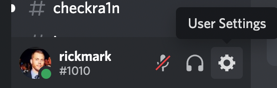
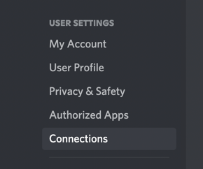

# How to link your Discord to your GitHub account

By linking your Discord and GitHub accounts you can lower friction for the core team and modirators to accepting your
pull requests.  Follow the steps below (optional) if you would like to add your GitHub to your Discord profile:

0. Open your profile settings in the discord server next to your handle

   
1. Navigate to the connections tab of your profile

   
2. ASelect the "GitHub" icon to create the link.  You will be
   redirected to a web browser to complete the connection.  If you are not logged into GitHub you will first be prompted
   to authenticate before proceeding.

   
3. Ensure you press "authorize" to allow discord to read your public GitHub profile.  You might need your U2F/Webauthn
   password to complete this process

## Why is linking valuable

When this is complete you will have your public GitHub username visible to anyone who views your Discord profile. We
can also use this to link roles in discord to the teams in GitHub to reduce friction fo the moderator team.
